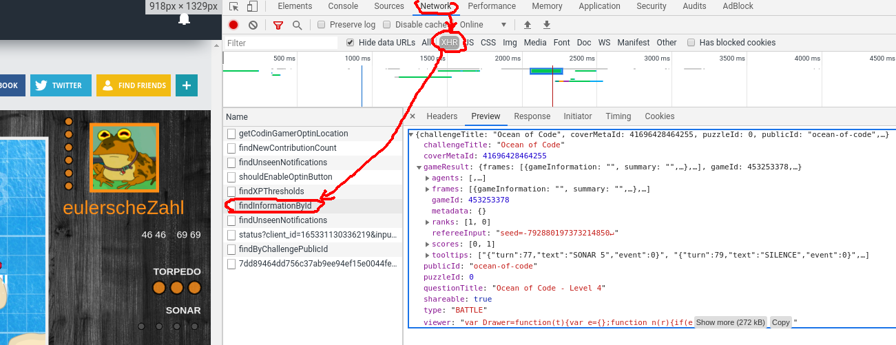
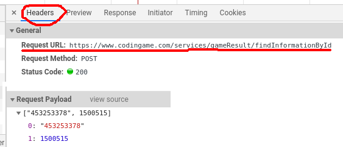
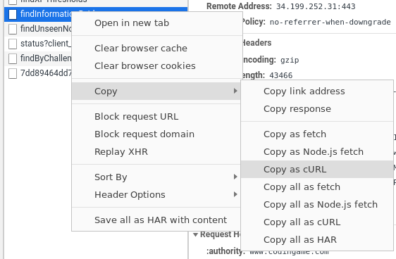

# Understanding the CodinGame API

First of all, let's find out how to get the replays for offline analysis.
I will use the Chromium webbrowser, but it's really similar in other browsers.

Open a replay of your choice and use the developer tools of your webbrowser (`F12`) to analyze the network traffic.
If the traffic section is empty, reload the page. There can be a lot of traffic going on, making it hard to find the request you are looking for. Filter for [XHR](https://en.wikipedia.org/wiki/XMLHttpRequest) to reduce the candidates.



Now that we've found the server response, we want to know how to get there. Specifically we want to know two things:
The request URL and the payload. Switch to the headers tab to see them. The first value sent in the payload is the game id, the second is my user id. You can set it to null if you don't want authentication.


Chromium even allows to copy the request as curl code:

This will contain some additional headers such as the user agent string of your browser which you don't need. You can either keep those or remove them.

Here is the request in wget (as curl isn't easily available on tech.io) without unnecessary headers.
```bash runnable
wget --header='Content-Type:application/json' --post-data='["453253378",null]' 'https://www.codingame.com/services/gameResult/findInformationById'
cat findInformationById
```
