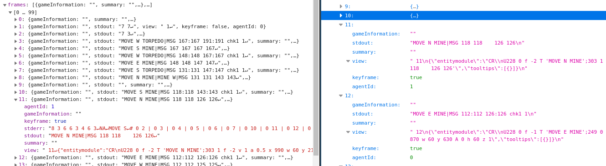

# Using the API with Python

Now that we know how to use the API, let's send some requests with Python!

The following code will download a replay:
@[Python]({"stubs": ["code/download.py"], "command": "code/download.py"})

I recommend to save it to your disk before running a complex analysis. That way you don't have to download it multiple times when your analysis code is buggy at first.

Let's have a closer look at what we just downloaded:

On the left you see the online version, on the right our downloaded json. The errorstream is missing. We need to login first in order to get it too.

Let's try again, this time with login. This code is intentionally not embedded in a runner, as it needs your login information in order to work properly. It's just for reference and offline execution.
``` python
import os, json, requests, sys

email = 'your@email.com'
pw = 'YourSecretP4ssw0rd'
userID = 1500515 # that's my userID, you have to change it
game_id = 453253378

# the session object saves cookies
with requests.Session() as s:
    # let's login first
	p = s.post('https://www.codingame.com/services/CodingamerRemoteService/loginSiteV2', json = [email, pw, True])
    # the same request as above, but with a session object
	r = s.post('https://www.codingame.com/services/gameResultRemoteService/findByGameId', json = [str(game_id), userID])
	replay = r.json()
	# TODO save your replay
```

**Note**:
You need a "real" CodinGame account to authenticate like this. If you use an OAuth like google login, you have to set a password on your CodinGame profile first.
This can be done in your [settings](https://www.codingame.com/settings).
