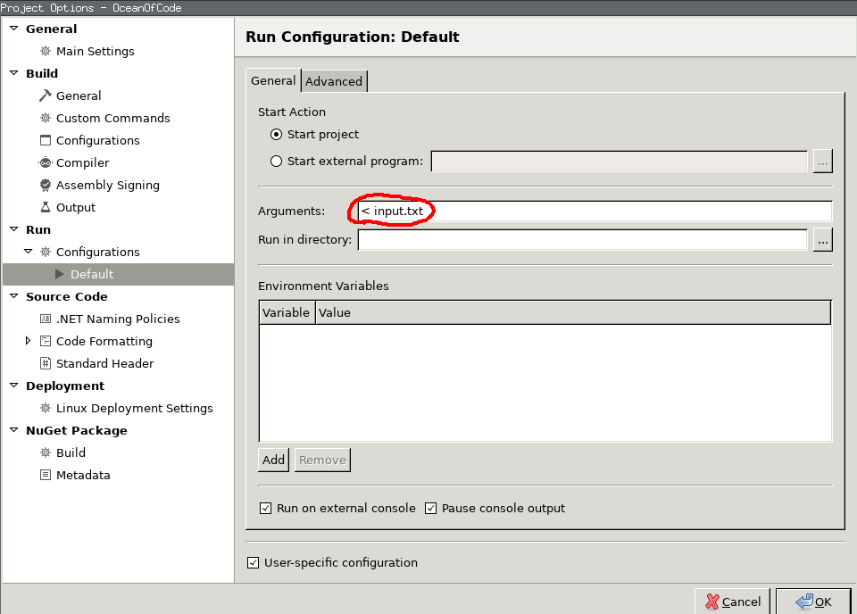

# IDE settings

Now that we successfully downloaded a replay, let's finally extract the errorstream of an entire game.
This allows to reproduce every step, as long as our own bot is deterministic.
My arena bot prints every input given by the referee directly to stderr so that I can read it again later.

@[Python]({"stubs": ["code/extract_stderr.py"], "command": "code/extract_stderr.py"})

Now we saved all the referee input to a single file. Now we can copy it in our terminal as input. Or we configure the IDE to read from file.

